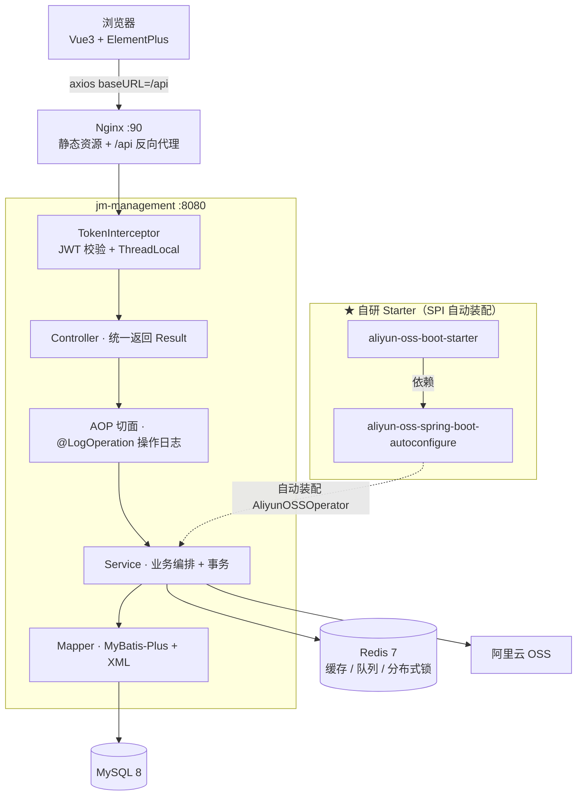

# 学途管家 · CRM 客户关系管理系统

> 基于 **Spring Boot 3 + MyBatis-Plus + Vue3** 的前后端分离 CRM 系统，打通「**线索 → 商机 → 客户**」完整销售转化链路。

## 一、项目简介

面向教育培训行业的客户关系管理系统，销售团队通过系统完成从获客到成交的全流程跟进：

```
线上活动/推广介绍 → 线索 →（分配/跟进/伪线索）→ 转商机 →（跟进/踢回公海）→ 转客户
```

同时提供活动管理、课程管理、用户/角色/部门管理、操作日志审计与首页数据看板。

## 二、技术栈

| 层次 | 技术 |
|------|------|
| 语言 / 框架 | Java 17 · Spring Boot 3.5 · Spring MVC · AOP · Scheduling |
| 持久层 | MyBatis-Plus 3.5（单表 CRUD + 分页）· MyBatis XML（多表关联、嵌套 resultMap） |
| 数据库 | MySQL 8 · HikariCP |
| 缓存 / 队列 | Redis 7 · Spring Data Redis（概览缓存、异步日志队列） |
| 分布式锁 | Redisson 3.27 |
| 鉴权 | JWT (jjwt) · HandlerInterceptor · ThreadLocal |
| 密码加密 | Spring Security Crypto（BCrypt，兼容历史 MD5 平滑迁移） |
| 对象存储 | 阿里云 OSS SDK（封装为自研 Starter） |
| 前端 / 部署 | Vue3 + ElementPlus · Nginx（静态资源 + `/api` 反向代理） |

## 三、系统架构



**请求链路**：`浏览器 → Nginx(:90) → /api 重写 → Spring Boot(:8080) → Interceptor 校验 token → Controller → Service → Mapper → MySQL`

## 四、数据库设计

共 11 张表。完整 DDL 可用 `mysqldump --no-data --default-character-set=utf8mb4 cpjm-parent > schema.sql` 从已有库导出。

| 表名 | 说明 |
|------|------|
| `clue` / `clue_track_record` | 线索主表 / 线索跟进记录 |
| `business` / `business_track_record` | 商机主表 / 商机跟进记录 |
| `customer` | 客户表（成交结果） |
| `activity` | 市场活动表 |
| `courses` | 课程表 |
| `user` / `role` / `department` | 用户 / 角色 / 部门（RBAC） |
| `operate_log` | 操作日志表（审计） |

**核心表关系**：`activity → clue`（来源）、`clue → business`（转商机）、`business → customer`（转客户）、`clue/business → user`（归属人）、`courses → business/customer`（意向课程）

**关键状态字典**：线索 `status` 1 待分配 · 2 待跟进 · 3 跟进中 · 4 伪线索 · 5 转为商机；商机 `status` 1 待分配 · 2 待跟进 · 3 跟进中 · 4 回收 · 5 转客户。

> - **线索池** `GET /clues/pool`：`status = 1` 的待分配线索，展示来源活动而非归属人
> - **商机公海池** `GET /businesses/pool`：`status = 4` 被回收的商机，归属人已置空

## 五、接口清单

> 统一响应 `{"code":1,"msg":"success","data":...}`；分页响应 `{"total":29,"rows":[...]}`；除 `POST /login` 外都需请求头携带 `token`。

| 模块 | 接口 |
|------|------|
| 登录 / 通用 | `POST /login` · `POST /upload` · `GET /report/overview` |
| 线索 | `GET /clues` · `POST /clues` · `GET /clues/{id}` · `PUT /clues` · `PUT /clues/assign/{clueId}/{userId}` · `PUT /clues/false/{id}` · `PUT /clues/toBusiness/{id}` · `GET /clues/pool` |
| 商机 | `GET /businesses` · `POST /businesses` · `GET /businesses/{id}` · `PUT /businesses` · `PUT /businesses/assign/{businessId}/{userId}` · `PUT /businesses/back/{id}` · `POST /businesses/toCustomer/{id}` · `GET /businesses/pool` |
| 客户 | `GET /customers` · `POST /customers` · `GET /customers/{id}` · `PUT /customers` |
| 活动 | `GET /activities` · `GET /activities/{id}` · `GET /activities/type/{type}` · `POST /activities` · `PUT /activities` · `DELETE /activities/{id}` |
| 课程 | `GET /courses` · `GET /courses/{id}` · `GET /courses/list` · `POST /courses` · `PUT /courses` · `DELETE /courses/{id}` |
| 系统管理 | `GET/POST/PUT /users` · `DELETE /users/{ids}` · `GET/POST/PUT /roles` · `DELETE /roles/{id}` · `GET /roles/list` · `GET/POST/PUT /depts` · `DELETE /depts/{id}` · `GET /depts/list` |
| 日志 | `GET /logs` · `DELETE /logs` |

## 六、本地启动

**前置环境**：JDK 17 · MySQL 8 · Redis 7（**必须启动**，否则概览接口报错）· Nginx 1.24（可选，仅访问前端时需要）。Maven 无需安装，工程自带 `mvnw`。

```bash
# 1. 创建数据库（库名带连字符，SQL 中需用反引号）
mysql -uroot -p -e "CREATE DATABASE IF NOT EXISTS \`cpjm-parent\` DEFAULT CHARSET utf8mb4;"

# 2. 建表：按「四、数据库设计」创建 11 张表

# 3. 构建（首次需把子模块装到本地仓库）
./jm-management/mvnw -f pom.xml clean install -DskipTests

# 4. 启动应用
java -jar jm-management/target/jm-management-0.0.1-SNAPSHOT.jar
# 或直接在 IDEA 中运行 JmManagementApplication
```

启动成功后控制台输出 `Tomcat started on port 8080`。

**登录**：系统未内置账号，首次需直接往 `user` 表插一条记录（此时还没有 token，无法调 `POST /users`）。密码支持 BCrypt，也兼容早期的 `MD5(明文 + "djh")` 格式（登录成功后会自动升级为 BCrypt）。下面这条用 MD5 格式插入，明文密码为 `123456`：

```sql
INSERT INTO `user`
  (username, password, name, phone, email, gender, status, dept_id, role_id, create_time, update_time)
VALUES
  ('admin', '558b1aa94403304b0f0ac1eae2884d9f', '管理员', '13800000000', 'admin@djh.com',
   1, 1, 3, 1, NOW(), NOW());
```

调用 `POST /login`，JSON 体 `{"username":"admin","password":"123456"}`。

**业务可调参数**（`application.yml`）：

```yaml
clue:
  recycle:
    threshold-days: 7        # 超过 N 天未跟进的线索自动回收到线索池
    cron: 0 0 2 * * ?        # 回收任务执行时间
operate:
  log:
    consume-interval-ms: 5000  # 操作日志队列消费间隔（毫秒）
```

**阿里云 OSS**（仅 `/upload` 需要）：配置环境变量 `OSS_ACCESS_KEY_ID`、`OSS_ACCESS_KEY_SECRET`，并在 `application.yml` 填 `aliyun.oss.endpoint / bucketName / region`。
