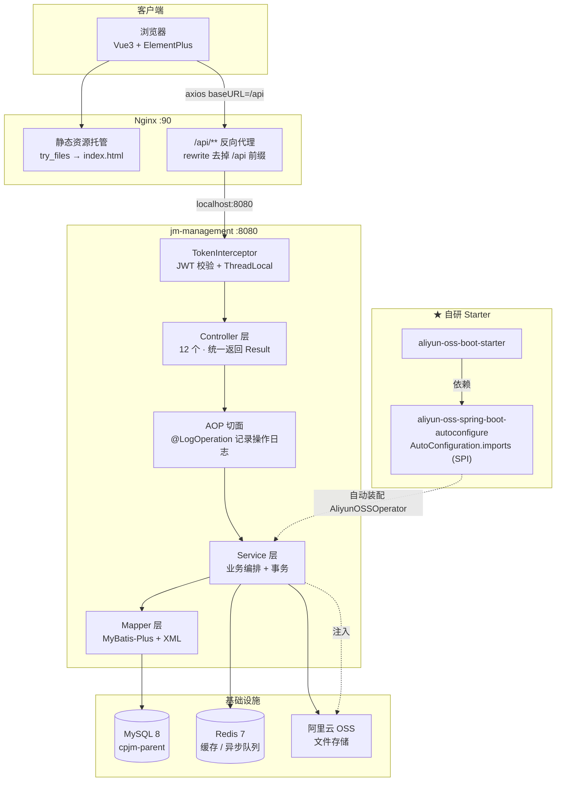
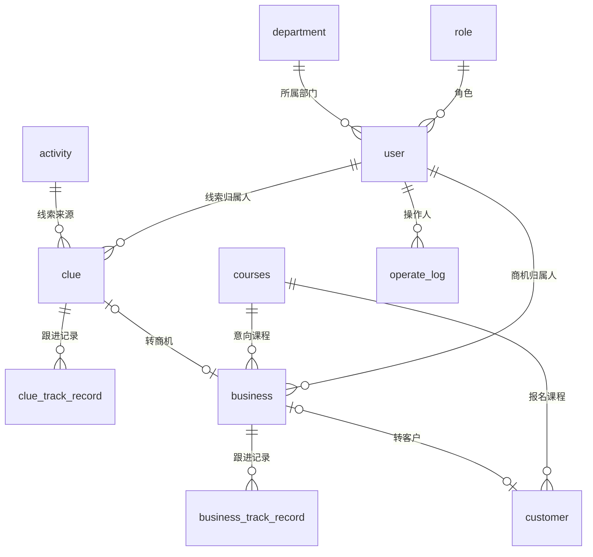

# 轻客管家 · CRM 客户关系管理系统（jm-parent）

> 基于 **Spring Boot 3 + MyBatis-Plus + Vue3** 的前后端分离企业级 CRM 系统
> 打通「**线索 → 商机 → 客户**」完整销售转化链路，含活动管理、课程管理、RBAC 权限、操作日志与首页数据看板

---

## 一、项目简介

轻客管家是一套面向教育培训行业的客户关系管理系统。销售团队通过系统完成从**获客**到**成交**的全流程跟进：

```
线上活动/推广介绍  →  线索  →（分配/跟进/伪线索）→  转商机  →（跟进/踢回公海）→  转客户
```

系统同时提供活动管理、课程管理、用户/角色/部门管理、操作日志审计与首页数据看板，是一套**业务闭环完整**的单体应用。

---

## 二、技术栈

| 层次 | 技术 | 版本 | 说明 |
|------|------|------|------|
| 语言 | Java | 17 | |
| 框架 | Spring Boot | 3.5.16 | Web / AOP / Scheduling |
| 持久层 | MyBatis-Plus | 3.5.8 | 单表 CRUD + 分页插件 |
| 持久层 | MyBatis + XML | - | 多表关联、动态 SQL、嵌套 resultMap |
| 数据库 | MySQL | 8.4.5 | 连接驱动 `com.mysql.cj.jdbc.Driver` |
| 连接池 | HikariCP | - | Spring Boot 默认 |
| 缓存/队列 | Redis + Spring Data Redis | 7.2.3 / Lettuce | 首页概览缓存、异步日志队列 |
| 鉴权 | JWT (jjwt) | 0.9.1 | 无状态令牌 |
| 对象存储 | 阿里云 OSS SDK | 3.17.4 | 文件上传 |
| 日志 | Logback + AOP | - | 操作日志切面记录入库 |
| 前端 | Vue3 + ElementPlus | - | 编译产物由 Nginx 托管 |
| 部署 | Nginx | 1.24.0 | 静态资源 + `/api` 反向代理 |
| 构建 | Maven | 多模块 | 自带 `mvnw` 包装器 |

---

## 三、工程结构

```
jm-parent/                                   父工程（统一依赖版本管理）
├── pom.xml                                  dependencyManagement 统一版本
├── db/
│   └── schema.sql                           建库建表脚本（11 张表）
├── jm-common/                               通用模块
│   └── src/main/java/
│       ├── com/djh/Result.java              统一响应封装
│       ├── com/djh/PageResult.java          统一分页封装
│       └── utils/JwtUtils.java              JWT 生成/解析工具
├── jm-entity/                               实体模块
│   └── src/main/java/com/djh/
│       ├── entity/                          11 个数据库实体
│       ├── dtp/                             查询参数 DTO
│       └── vo/                              视图对象（LoginResultVo、OverviewVO）
├── jm-management/                           业务模块（可执行应用）
│   └── src/main/
│       ├── java/com/djh/
│       │   ├── controller/                  12 个 Controller
│       │   ├── service/ + service/impl/     Service 接口与实现
│       │   ├── mapper/                      MyBatis-Plus Mapper
│       │   ├── interceptor/                 TokenInterceptor 令牌校验
│       │   ├── filter/                      Filter 方案（已弃用，保留参考）
│       │   ├── aop/                         LogAspect 操作日志切面
│       │   ├── anno/                        @LogOperation 自定义注解
│       │   ├── config/                      WebConfig、MybatisConfig、...
│       │   ├── exception/                   全局异常处理
│       │   └── utils/                       CurrentUserHoler（ThreadLocal）
│       └── resources/
│           ├── application.yml              数据源/MyBatis-Plus/Redis/OSS 配置
│           └── mapper/*.xml                 MyBatis XML（多表关联 SQL）
├── aliyun-oss-spring-boot-autoconfigure/    ★ 自研 Starter - 自动装配模块
└── aliyun-oss-boot-starter/                 ★ 自研 Starter - 依赖聚合模块
```

---

## 四、系统架构



**请求链路**：`浏览器 → Nginx(:90) → /api 重写 → Spring Boot(:8080) → Interceptor 校验 token → Controller → Service → Mapper → MySQL`

---

## 五、核心业务流程

### 5.1 状态字典

| 业务对象 | 状态字段 | 取值 |
|---------|---------|------|
| 线索 clue | `status` | 1 待分配 · 2 待跟进 · 3 跟进中 · 4 伪线索 · 5 转为商机 |
| 商机 business | `status` | 1 待分配 · 2 待跟进 · 3 跟进中 · 4 回收 · 5 转客户 |
| 线索意向等级 | `level` | 1 近期学习 · 2 打算学习(考虑中) · 3 进行了解 · 4 打酱油 |
| 意向学科 | `subject` | 1 AI智能应用开发(Java) · 2 AI大模型开发(Python) · 3 AI鸿蒙 · 4 AI大数据 · 5 AI嵌入式 · 6 AI测试 · 7 AI运维 |
| 渠道来源 | `channel` | 1 线上活动 · 2 推广介绍 |
| 学历 | `degree` | 1 高中 · 2 中专 · 3 大专 · 4 本科 · 5 硕士 · 6 博士 · 7 其他 |
| 伪线索原因 | `false_reason` | 1 空号 · 2 停机 · 3 竞品 · 4 无法联系 · 5 其他 |
| 商机跟进状态 | `track_status` | 1 接通 · 2 拒绝 · 3 无人接听 |

### 5.2 线索 → 商机 → 客户 流转

```mermaid
stateDiagram-v2
    [*] --> 待分配: 新增线索 / 活动获客
    待分配 --> 待跟进: 分配线索(assign)
    待跟进 --> 跟进中: 跟进线索(track)<br/>写跟进记录
    跟进中 --> 跟进中: 多次跟进
    待跟进 --> 伪线索: 伪线索处理(false)<br/>写伪线索记录
    跟进中 --> 伪线索: 伪线索处理
    待跟进 --> 转为商机: 转商机(toBusiness)
    跟进中 --> 转为商机: 转商机(toBusiness)
    伪线索 --> [*]

    转为商机 --> 商机待分配: 生成商机(status=1)
    商机待分配 --> 商机待跟进: 分配商机(assign)
    商机待跟进 --> 商机跟进中: 跟进商机(track)
    商机跟进中 --> 商机跟进中: 多次跟进
    商机待跟进 --> 商机公海: 踢回公海(back)
    商机跟进中 --> 商机公海: 踢回公海(back)
    商机跟进中 --> 客户: 转客户(toCustomer)
    商机公海 --> 商机待跟进: 重新分配
    客户 --> [*]
```



> 两个「池」的语义：
> - **线索池** `GET /clues/pool`：`status = 1` 的待分配线索，展示来源活动而非归属人
> - **商机公海池** `GET /businesses/pool`：`status = 4` 被回收的商机，归属人已置空

---

## 六、数据库设计

> 完整建表语句见 [`db/schema.sql`](db/schema.sql)

| 表名 | 说明 | 关键字段 |
|------|------|---------|
| `clue` | 线索表（销售线索主表） | `phone`(唯一)、`channel`、`activity_id`、`user_id`(归属人)、`status`、`subject`、`level`、`next_time` |
| `clue_track_record` | 线索跟进记录表 | `clue_id`、`user_id`、`subject`、`level`、`record`、`type`(1正常/0伪线索)、`false_reason` |
| `business` | 商机表 | `phone`(唯一)、`clue_id`(来源线索)、`user_id`、`course_id`、`status`、`next_time` |
| `business_track_record` | 商机跟进记录表 | `business_id`、`user_id`、`track_status`、`key_items`(沟通重点)、`record` |
| `customer` | 客户表（成交结果） | `phone`(唯一)、`business_id`(来源商机)、`course_id`、`degree`、`job_status` |
| `activity` | 市场活动表 | `name`、`channel`、`start_time`、`end_time`、`type`(1折扣/2代金券)、`discount`、`voucher` |
| `courses` | 课程表 | `name`、`subject`、`price`、`target`(适用人群) |
| `user` | 用户表（销售/员工） | `username`(唯一)、`password`(MD5加盐)、`dept_id`、`role_id`、`status` |
| `role` | 角色表 | `name`、`label`(角色标识，前端用于菜单权限) |
| `department` | 部门表 | `name`(唯一)、`status` |
| `operate_log` | 操作日志表（审计） | `operate_user_id`、`class_name`、`method_name`、`method_params`、`return_value`、`cost_time` |

**核心表关系**：



---

## 七、接口清单

> 统一响应格式：`{"code": 1, "msg": "success", "data": ...}`（`code=1` 成功，`0` 失败）
> 分页响应：`{"total": 29, "rows": [...]}`
> 除 `POST /login` 外，所有接口需在请求头携带 `token`

### 7.1 登录与通用

| 方法 | 路径 | 说明 |
|------|------|------|
| POST | `/login` | 用户登录，返回 JWT 令牌与角色标识 |
| POST | `/upload` | 上传图片到阿里云 OSS，返回文件 URL |
| GET | `/report/overview` | 首页概览数据（线索/商机各状态统计） |

### 7.2 线索管理

| 方法 | 路径 | 说明 |
|------|------|------|
| GET | `/clues` | 线索列表分页查询（clueId/phone/status/channel/assignName） |
| POST | `/clues` | 新增线索（初始 status=1 待分配） |
| GET | `/clues/{id}` | 线索详情（含 trackRecords 跟进记录） |
| PUT | `/clues` | 跟进线索（更新状态 + 写跟进记录） |
| PUT | `/clues/assign/{clueId}/{userId}` | 分配线索给指定销售 |
| PUT | `/clues/false/{id}` | 伪线索处理（body: reason / remark） |
| PUT | `/clues/toBusiness/{id}` | 线索转商机 |
| GET | `/clues/pool` | 线索池列表（待分配线索） |

### 7.3 商机管理

| 方法 | 路径 | 说明 |
|------|------|------|
| GET | `/businesses` | 商机列表分页查询（businessId/name/phone/status） |
| POST | `/businesses` | 新增商机 |
| GET | `/businesses/{id}` | 商机详情（含 trackRecords 跟进记录） |
| PUT | `/businesses` | 跟进商机（trackStatus/keyItems/record + 更新状态） |
| PUT | `/businesses/assign/{businessId}/{userId}` | 分配商机 |
| PUT | `/businesses/back/{id}` | 踢回公海（status=4，归属人置空） |
| POST | `/businesses/toCustomer/{id}` | 商机转客户 |
| GET | `/businesses/pool` | 公海池列表（status=4） |

### 7.4 客户管理

| 方法 | 路径 | 说明 |
|------|------|------|
| GET | `/customers` | 客户列表分页查询（phone/name/channel/subject） |
| POST | `/customers` | 新增客户 |
| GET | `/customers/{id}` | 客户详情 |
| PUT | `/customers` | 修改客户 |

### 7.5 活动管理

| 方法 | 路径 | 说明 |
|------|------|------|
| GET | `/activities` | 活动分页查询（channel/type/status 按时间推算未开始/进行中/已结束） |
| GET | `/activities/{id}` | 活动详情 |
| GET | `/activities/type/{type}` | 按类型查询活动 |
| POST | `/activities` | 新增活动 |
| PUT | `/activities` | 修改活动 |
| DELETE | `/activities/{id}` | 删除活动 |

### 7.6 课程管理

| 方法 | 路径 | 说明 |
|------|------|------|
| GET | `/courses` | 课程分页查询（name/subject/target） |
| GET | `/courses/{id}` | 课程详情 |
| GET | `/courses/list` | 查询所有课程（下拉列表用） |
| POST | `/courses` | 新增课程 |
| PUT | `/courses` | 修改课程 |
| DELETE | `/courses/{id}` | 删除课程 |

### 7.7 系统管理（用户/角色/部门/日志）

| 方法 | 路径 | 说明 |
|------|------|------|
| GET | `/users` | 用户分页查询 |
| POST | `/users` | 新增用户（密码 MD5 加盐） |
| PUT | `/users` | 修改用户 |
| DELETE | `/users/{ids}` | 批量删除用户 |
| GET | `/roles` | 角色分页查询 |
| GET | `/roles/{id}` | 角色详情 |
| GET | `/roles/list` | 查询所有角色 |
| POST | `/roles` | 新增角色 |
| PUT | `/roles` | 修改角色 |
| DELETE | `/roles/{id}` | 删除角色 |
| GET | `/depts` | 部门分页查询 |
| GET | `/depts/{id}` | 部门详情 |
| GET | `/depts/list` | 查询所有部门 |
| POST | `/depts` | 新增部门 |
| PUT | `/depts` | 修改部门 |
| DELETE | `/depts/{id}` | 删除部门 |
| GET | `/logs` | 操作日志分页查询（operateUserName 模糊） |
| DELETE | `/logs` | 清空操作日志 |

---

## 八、本地启动

### 8.1 前置环境

| 依赖 | 版本 | 说明 |
|------|------|------|
| JDK | 17+ | 设置 `JAVA_HOME` |
| MySQL | 8.x | 默认 `localhost:3306` |
| Redis | 7.x | 默认 `localhost:6379`，**必须启动**，否则首页概览接口报错 |
| Nginx | 1.24+ | 可选，仅访问前端页面时需要 |

> Maven 无需单独安装，工程自带 `mvnw` 包装器。

### 8.2 初始化数据库

```bash
# 1. 创建数据库（注意库名带连字符，SQL 中需用反引号）
mysql -uroot -p -e "CREATE DATABASE IF NOT EXISTS \`cpjm-parent\` DEFAULT CHARSET utf8mb4 COLLATE utf8mb4_0900_ai_ci;"

# 2. 导入表结构
mysql -uroot -p --default-character-set=utf8mb4 cpjm-parent < db/schema.sql
```

### 8.3 启动 Redis

```bash
redis-server /path/to/redis.conf
# 验证
redis-cli ping   # 期望输出 PONG
```

### 8.4 配置阿里云 OSS（使用 `/upload` 接口时需要）

`aliyun-oss-spring-boot-autoconfigure` 通过 `EnvironmentVariableCredentialsProvider` 读取凭证，需配置**环境变量**（配置后需重启 IDE 才能生效）：

```
OSS_ACCESS_KEY_ID=你的AccessKeyId
OSS_ACCESS_KEY_SECRET=你的AccessKeySecret
```

Bucket 区域等非敏感配置在 `jm-management/src/main/resources/application.yml`：

```yaml
aliyun:
  oss:
    endpoint: https://oss-cn-beijing.aliyuncs.com
    bucketName: 你的bucket名称
    region: cn-beijing        # V4 签名必需
```

### 8.5 修改数据源配置

`jm-management/src/main/resources/application.yml`：

```yaml
spring:
  datasource:
    url: jdbc:mysql://localhost:3306/cpjm-parent
    username: root
    password: 你的密码
    driver-class-name: com.mysql.cj.jdbc.Driver
```

### 8.6 构建与启动

```bash
# 在 jm-parent 根目录
# 首次构建：需要把 jm-common / jm-entity / 自研 starter 安装到本地仓库
./jm-management/mvnw -f pom.xml clean install -DskipTests

# 启动应用
java -jar jm-management/target/jm-management-0.0.1-SNAPSHOT.jar
# 或直接在 IDEA 中运行 JmManagementApplication
```

启动成功后控制台出现：

```
Tomcat started on port 8080 (http)
Started JmManagementApplication in 7.5 seconds
```

### 8.7 启动前端（可选）

前端为编译产物，由 Nginx 托管，`conf/nginx.conf` 关键配置：

```nginx
server {
    listen 90;
    location / {
        root   html;
        try_files $uri $uri/ /index.html;
    }
    location /api {
        rewrite ^/api/(.*)$ /$1 break;
        proxy_pass http://localhost:8080;
    }
}
```

启动 Nginx 后访问 `http://localhost:90`。

### 8.8 登录

系统未内置初始账号，需先在 `user` 表中插入一条记录。密码为 **MD5(明文 + "djh")** 加盐存储，例如明文 `123456` 对应：

```sql
INSERT INTO `user`
  (username, password, name, phone, email, gender, status, dept_id, role_id, create_time, update_time)
VALUES
  ('admin', '558b1aa94403304b0f0ac1eae2884d9f', '管理员', '13800000000', 'admin@djh.com',
   1, 1, 3, 1, NOW(), NOW());
```

登录方式：`POST /login`，JSON 体 `{"username":"admin","password":"123456"}`。

### 8.9 接口自测

```bash
# 登录拿 token
curl -X POST http://localhost:8080/login \
     -H "Content-Type: application/json" \
     -d '{"username":"admin","password":"123456"}'

# 带 token 访问业务接口
curl http://localhost:8080/clues?page=1&pageSize=10 -H "token: <上一步返回的token>"
```

---

## 九、项目亮点与实现思路

### 9.1 ★ 自研 Spring Boot Starter（阿里云 OSS）

**问题**：项目多处需要上传文件，如果每个模块都手写一遍 OSS 客户端初始化和配置读取，会产生大量重复代码。

**做法**：按 Spring Boot 官方规范把「OSS 上传能力」封装成可复用的 Starter，拆成两个模块：

| 模块 | 职责 |
|------|------|
| `aliyun-oss-boot-starter` | 空 jar，只负责聚合依赖（引入 autoconfigure） |
| `aliyun-oss-spring-boot-autoconfigure` | 真正的自动装配逻辑 |

自动装配三要素：

1. **属性绑定类** `AliyunOSSProperties`：`@ConfigurationProperties(prefix = "aliyun.oss")` 把 yml 里的 `endpoint/bucketName/region` 绑定成对象
2. **自动配置类** `AliyunOSSAutoConfiguration`：`@EnableConfigurationProperties` + `@Bean` 把 `AliyunOSSOperator` 注册进容器
3. **SPI 注册**：`META-INF/spring/org.springframework.boot.autoconfigure.AutoConfiguration.imports`（Spring Boot 3 的新规范，替代 Spring Boot 2 的 `spring.factories`）

**收益**：业务模块只需加一个依赖 + 写几行 yml，`@Autowired AliyunOSSOperator` 即可上传，完全感知不到 OSS SDK 的存在。

### 9.2 统一响应 + 全局异常处理

- `Result`：所有 Controller 统一返回 `{code, msg, data}`，前端拦截器只需判断一个 `code`
- `@RestControllerAdvice` + `@ExceptionHandler`：业务异常 `BusinessException`、参数异常、未捕获异常分别处理，避免异常堆栈直接暴露给前端
- 对比：**缺少 `@RestControllerAdvice` 时 `@ExceptionHandler` 只在当前 Controller 内生效**，这是一个高频踩坑点

### 9.3 JWT 无状态鉴权 + ThreadLocal 传递当前用户

链路：`登录签发 token → 前端 localStorage 保存 → 请求头携带 → TokenInterceptor 校验解析 → 存入 ThreadLocal → 业务层随时取用`

- 令牌校验放在 `HandlerInterceptor#preHandle`，`/login` 放行
- 当前用户 ID 存 `ThreadLocal`（`CurrentUserHoler`），Service 层无需层层传参
- **关键细节**：在 `afterCompletion` 中调用 `remove()` 清理 ThreadLocal。Tomcat 线程池会复用线程，不清理会导致「上一个请求的用户 ID 泄漏给下一个请求」，并造成内存泄漏
- **踩坑记录**：jjwt 0.9.1 的 `signWith(alg, String)` 会先把字符串按 **Base64 解码**，因此密钥必须传 Base64 合法字符串，否则解出空字节数组报 `secret key byte array cannot be null or empty`。本项目改用 `byte[]` 重载（`SECRET_KEY.getBytes(UTF_8)`）彻底规避

### 9.4 AOP + 自定义注解实现操作日志

`@LogOperation` 注解标记需要审计的方法，`LogAspect` 以 `@Around` 环绕通知织入：

```
记录开始时间 → 执行目标方法 → 计算耗时 → 组装 OperateLog（类名/方法名/参数/返回值/耗时/操作人）→ 入库
```

**设计要点**：注解驱动，业务代码零侵入——想审计哪个方法，加个注解就行。

### 9.5 MyBatis-Plus + XML 混合使用

| 场景 | 方案 | 原因 |
|------|------|------|
| 单表增删改查 | MyBatis-Plus `BaseMapper` / `ServiceImpl` | 零 SQL，开发效率高 |
| 多表关联、动态条件 | XML `<select>` + `<where>/<if>` | 复杂 SQL 用 MP 包装器反而更难维护 |
| 一对多嵌套结果 | XML `<resultMap>` + `<collection>` | 一次查询把主表和跟进记录一起映射，避免 N+1 |

例：线索详情的 `clueResultMap` 用 `<collection>` 把 `clue_track_record` 的字段（别名 `tr_*`）映射进 `Clue.trackRecords` 列表，一条 SQL 拿到「线索 + 全部跟进记录」。

### 9.6 Redis 缓存首页概览数据

首页概览接口 `GET /report/overview` 需要跨表统计线索和商机的各状态数量，属于**聚合查询、耗时长但变化慢**的典型场景，适合加缓存：

```
查 Redis → 命中直接返回
       ↓ 未命中
   查 MySQL（线索统计 + 商机统计，BeanUtils 合并）
       ↓
   写入 Redis（设置 5 分钟过期）
```

**为什么一定要设过期时间**：不设过期，数据库更新后缓存永远是旧数据；设了过期，最多脏 5 分钟就能自动纠正。

### 9.7 自定义 `@TableName` 解决表名映射

MyBatis-Plus 默认把实体类名转小写当表名（`Course` → `course`），但项目实际表名是 `courses`、`department`，类名与表名不一致时必须在实体上加 `@TableName("courses")`，否则会报 `Table 'xxx' doesn't exist`。

> 注意：只有**走 MyBatis-Plus 内置方法**的实体才需要；像 `DeptMapper` 那样全部手写 SQL 的，不需要加。

---

## 十、已知待改进项

| 问题 | 影响 | 建议 |
|------|------|------|
| `RedisTemplate<Object,Object>` 默认 JDK 序列化 | 缓存 key 是二进制乱码，redis-cli 里不可读、难排查 | 配置 `StringRedisSerializer` 作为 key 序列化器 |
| 密码 MD5 加盐 | MD5 已被证明不安全，易被彩虹表攻击 | 换 BCrypt（需兼容存量密码） |
| 项目内存在两套分页机制 | PageHelper 与 MyBatis-Plus 分页插件同时生效会导致 SQL 出现**两个 LIMIT** | 统一使用 MyBatis-Plus 分页 |
| 缺少参数校验 | 非法入参直接进业务层 | Controller 加 `@Validated` + JSR-303 注解 |
| 缺少单元测试 | 改动无法快速验证 | 补 Service 层单测 + MockMvc 接口测试 |
| 无接口文档 | 前后端联调靠口头约定 | 引入 Knife4j / Swagger |

---

## 附：默认端口一览

| 服务 | 端口 |
|------|------|
| Spring Boot 应用 | 8080 |
| MySQL | 3306 |
| Redis | 6379 |
| Nginx（前端） | 90 |
